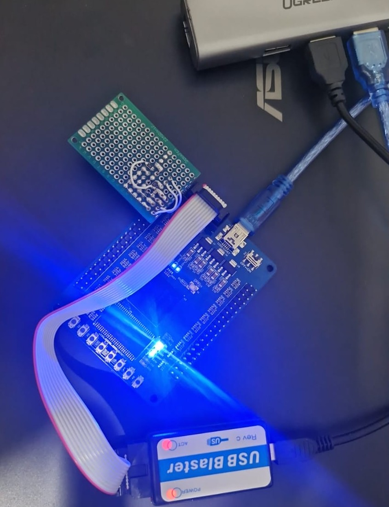

# Cyclone IV RISC-V SoC (SDRAM + Bootloader + PWM)

Soft-core RISC-V (Nios V) SoC template para placas genéricas Cyclone IV (`EP4CE6F17C8`) com controlador SDRAM, boot via SPI Flash genérica externa e módulo PWM personalizado em VHDL.

[BUILD.md](BUILD.md) -- comandos de build/BSP/gravação passo a passo





## Visão geral do hardware

| Item | Detalhe |
|---|---|
| FPGA | Intel/Altera Cyclone IV E, `EP4CE6F17C8` |
| CPU | Nios V/m (`intel_niosv_m`, variante 2), RV32I, sem cache (I$/D$ = 0) |
| Clock de sistema | 50 MHz (gerado por PLL, `altpll_0`, a partir do oscilador da placa) |
| RAM interna (on-chip) | 16 KB, `onchip_memory2_0` |
| SDRAM externa | 32 MB, `new_sdram_controller_0` (barramento de 16 bits, 4 bancos) |
| Flash de firmware | SPI genérica (`spi_0`) -- Winbond W25Q16 (2 MiB) ou AMIC A25L80P (1 MiB útil, 960 KiB) detectada em runtime pelo JEDEC ID
| Config. da FPGA | Sem dispositivo de configuração serial (`USE_CONFIGURATION_DEVICE OFF`) -- gravação via JTAG |
| Outros periféricos | UART (115200 8N1), 2x PIO (LEDs/botões), PWM próprio |

Definido no Platform Designer/Qsys em [niosV_ip.qsys](niosV_ip.qsys)
(sistema `niosV_ip`) e sintetizado pelo projeto Quartus
[niosV.qpf](niosV.qpf) / [niosV.qsf](niosV.qsf).

## Arquitetura: Von Neumann

O Nios V/m aqui é **Von Neumann**: instruções e dados compartilham o mesmo
espaço de endereçamento e as mesmas memórias físicas -- tanto a RAM interna
(`onchip_memory2_0`) quanto a SDRAM (`new_sdram_controller_0`) guardam
código *e* dados/pilha/heap ao mesmo tempo, sem regiões reservadas
separadas para instrução e dado.

Detalhe de implementação (não muda a classificação acima): o núcleo expõe
duas portas Avalon distintas -- `instruction_manager` e `data_manager` --
para poder buscar instrução e acessar dado no mesmo ciclo sem disputar um
único barramento. Mas `instruction_manager` só chega às duas memórias que
podem conter código (RAM interna e SDRAM, no mesmo endereço que
`data_manager` usa para elas); todo o resto do mapa de memória (UART, SPI,
PIO, PWM, PLL) só é alcançável por `data_manager`. Ou seja: duas portas de
barramento por desempenho, mas uma memória só e um único mapa de
endereços -- não é Harvard (que exigiria memórias/endereços de instrução e
dado fisicamente separados).

## Topologia de memória

```
0x0000_0000  onchip_memory2_0     16 KB   RAM interna -- bootloader (INIT_FILE)
0x0200_0000  new_sdram_controller_0  32 MB  SDRAM -- aplicação (código+dados+pilha+heap)
0x0000_8000  periféricos (altpll, pio_0/1, pwm_0, spi_0, uart_0) -- ver system.h de cada BSP
```

### RAM interna (`onchip_memory2_0`, 16 KB)

Onde o **bootloader** roda inteiro (código, pilha e heap) -- por isso ele é
mantido pequeno e com pouquíssima verbosidade. O conteúdo inicial dessa
memória é gravado *dentro do bitstream* via `INIT_FILE`
(`ONCHIP_MEMORY2_0_INIT_CONTENTS_FILE = "bootloader"`): trocar o bootloader
exige gerar um novo `.hex` a partir do `.elf` (`elf2hex`), rodar **Update
Memory Initialization File + Start Assembler** no Quartus e regravar a FPGA
via JTAG -- não é algo que se atualiza em campo pela serial.

### SDRAM (`new_sdram_controller_0`, 32 MB)

Onde a **aplicação** (`software/app`) é copiada para rodar, e também serve
de área de *staging* para uma imagem `.nvbi` recebida pela UART antes de
ser gravada na flash. Como é volátil, o bootloader precisa copiar a
aplicação da flash para cá em todo boot.

### Flash SPI de firmware ( Winbond W25Q16 / AMIC A25L80P )

Guarda o cabeçalho da imagem de boot + o binário da aplicação de forma
persistente (sobrevive a desligar a placa). Acessada pelo núcleo Avalon-SPI
genérico `spi_0` (clock SPI a 1 MHz), driver único em
[software/common/spi_flash.c](software/common/spi_flash.c) com **detecção
do chip em runtime pelo JEDEC ID** (não é fixo em tempo de compilação).

Dois chips suportados hoje:

- **Winbond W25Q16BV/BAV** (2 MiB) -- Chip padrão atual, sem problemas,
 imagem começa normalmente em `0x000000`. Recomendada para uso real.

- **AMIC A25L80P** (1 MiB) -- o **setor 0** (`0x000000`-`0x00FFFF`) desse
  chip especificamente se mostrou **não confiável para erase/gravação**
 -- ver o comentário grande em `spi_flash.c`. O driver recusa
  automaticamente qualquer erase/gravação nesse setor
  (`SPI_FLASH_ERR_CHIP_UNRELIABLE`), e o bootloader desloca a imagem
  inteira para começar no setor 1 (`0x010000`) quando detecta esse chip --
  perde 64 KB de capacidade útil, mas nunca toca a região problemática.


### EPCS4

Memória SPI Flash de configuração do hardware do FPGA e bootloader,
**não faz parte do hardware gerado** e não aparece no `system.h` de
nenhum BSP. É gravada apenas via JTAG, no arquivo `.jic`.

## Estrutura do software

```
software/
  bootloader/       bootloader (roda na RAM interna, ver README próprio)
  bootloader_bsp/    BSP gerado para o bootloader (drive mínimo)
  app/               aplicação principal (roda na SDRAM, ver README proprio)
  bsp/                BSP gerado para a app
  common/             driver spi_flash.c/.h compartilhado pelos 3 acima
```

O driver de flash é um só (`software/common/spi_flash.c`/`.h`), referenciado
via caminho relativo pelos `CMakeLists.txt` -- evita ter cópias
divergentes do mesmo código.

## Atualização de firmware via serial

Protocolo binário simples pela UART (handshake, pacotes com CRC32,
relatório de erro estruturado) -- descrito em detalhe em
[software/bootloader/README.md](software/bootloader/README.md). 

necessário o `python` e `pyserial`:

`pip install pyserial`

Ver detalhes em:

[BUILD.md](BUILD.md) -- comandos de build/BSP/gravação passo a passo

## Compilando e gravando

ver detalhes em:

[BUILD.md](BUILD.md) -- comandos de build/BSP/gravação passo a passo

## Veja também

- [software/bootloader/README.md](software/bootloader/README.md) -- Protocolo de atualização, layout da imagem `.nvbi`
- [software/app/README.md](software/app/README.md) -- Software principal
- [BUILD.md](BUILD.md) -- comandos de build/BSP/gravação passo a passo
- [docs/pinout.csv](pcb/pinout_completo.csv) -- pinout completo
- [docs/board.jpeg](pcb/operando.jpeg) -- Foto
- [docs/EP4CE6_Generic_Board_Schematic](EP4CE6_Generic_Board_Schematic.pdf) -- Diagrama Esquemático

## Soluções para Problemas que você pode encontrar no Quartus Prime Lite 25.1

### ALTPLL IP Parameter Editor:

- [Text overlap in the ALTPLL IP Parameter Editor](https://community.altera.com/kb/knowledge-base/why-does-the-text-overlap-in-the-altpll-ip-parameter-editor/349903) -- Sobreposição de texto no ALTPLL IP Parameter Editor no Quartus

### Ausência do controlador SDRAM: para resolver, você precisa ter a versão antiga e a nova do programa. Passos:

- Encontrar a pasta altera_avalon_new_sdram_controller na pasta da versão antiga do programa (testado com a 20.1) e copiar para a pasta da versão nova do programa (testado com a 25.1).
- Encontrar, nas pastas de ambas as versões do programa, o arquivo `altera_components.ipx`, fazer um backup dos arquivos em uma pasta na sua pasta Documentos, renomeando cada arquivo para `altera_components20_1.ipx` e `altera_components25_1.ipx`.

- Criar uma cópia: `altera_components25_1.ipx` -> `altera_components.ipx`
- Abrir o arquivo `altera_components20_1.ipx` e copiar o trecho correspondente ao componente para o arquivo `altera_components.ipx`.

```
<component
   name="altera_avalon_new_sdram_controller"
   .
   .
   .
</component>
```
- Copiar o arquivo `altera_components.ipx` para a pasta da nova versão do programa, sobrescrevendo-o.

# Licença e Uso

Este projeto possui duas naturezas de licenciamento:

Código Personalizado (MIT License): Os códigos VHDL autorais (como o módulo PWM), o código em C desenvolvido para o Nios V e a estrutura geral do repositório estão licenciados sob a MIT License. Sinta-se livre para usar, modificar e distribuir.

Intel FPGA IP Cores: Os arquivos gerados pela ferramenta Platform Designer/Qsys (Controlador SDRAM, JTAG UART, Nios V Processor, etc.) contêm propriedade intelectual da Intel/Altera. O uso desses arquivos está sujeito ao Intel MegaCore Function License Agreement e eles são estritamente restritos ao uso em dispositivos da família Intel/Altera.